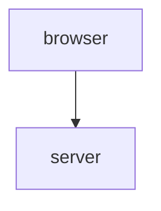
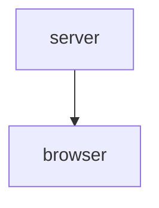

Studies.cs.helsinki.fi/exampleapp/notes

Selain teki POST-metodin yllä olevaan osoitteeseen, jonka status koodi on 302

Selain tekee GET-metodlilla pyynnön osoitteeseen https://studies.cs.helsinki.fi/exampleapp/notes

Palvein vastasi headerissa sisällön tyypillä text/html; charset=utf-8, joka kertoo selaimelle renderöidä kyseinen tekstitiedosto webbisivuna.

Vastattu sisältö on normaali HTML-sivu, jossa on body elementin sisällä otsikko Notes ja sen alla 'notes' id:llä kirjoitetut tekstit.

HTML tekstin sisällä on myös head-elementin sisällä myös linkki css tiedostoon, minkä myös selain tekee erillisenä GET pyyntönä. Sama tehdään myös script tiedostolle, jonka tyyppi on javascript.

CSS tiedosto määrittelee webbisivun ulkonäön ja esiteltävän tekstin värin.

Javascript tiedosto määrittää, mitä kyseisen HTML sivun sisällä tulee tehdä, ennenkuin sivu näytetään käyttäjälle. Scriptissä käydään kaikki tallennetut notesit läpi silmukalla ja ne laitetaan listaelementissä HTML tiedostoon. Javascript saa aikaisempien tallennetut 'notesit' GET pyynnöllä, millä haetaan ddata.json

GET metodi https://studies.cs.helsinki.fi/exampleapp/data.json

HTML documentissa löytyy sisältä form action-elementti, mikä sisältää tekstikentän text ja tallennuspainikkeen submit. Tallennuspainiketta painamalla selain tekee POST pyynnön kuormanaan (payload) tekstikentän sisältö ja kaikki ylläoleva tapahtuu uudestaan.