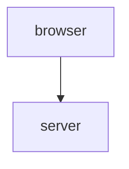
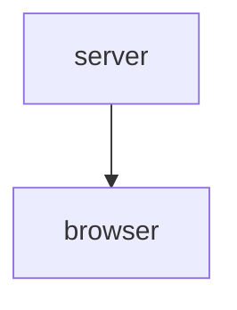
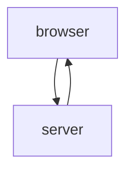

Selain tekee GET-metodilla pyynnön osoitteeseen https://studies.cs.helsinki.fi/exampleapp/spa

Statuskoodi on 200 eli OK.

Palvelin vastaa tekstillä text/html; charset=utf-8 muodossa, joka on kirjoitettu HTML muodossa. Selain tunnistaa sen webbisivuksi.

HTML documentissa head elementissä on css linkki "/exampleapp/main.css" ja script "/exampleapp/spa.js"

Selain hakee nämä GET-metodilla palvelimelta.

GET https://studies.cs.helsinki.fi/exampleapp/main.css

GET https://studies.cs.helsinki.fi/exampleapp/spa.js

Palvein palauttaa pyydetyt asiat statuskoodilla 200 eli OK

CSS tiedosto kertoo, että sivulla container elementti on padding 10px reunoista ja elementillä on yksivärinen reuna, jonka leveys on 1px.

Javascript tiedostossa haetaan tallennetut tekstit ja lisätään ne listana container elementtiin. Tallennetut tekstit haetaan GET pyynnöllä.

GET https://studies.cs.helsinki.fi/exampleapp/data.json

