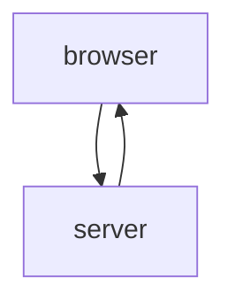

Selain tekee POST-metodilla pyynnön osoitteeseen https://studies.cs.helsinki.fi/exampleapp/new_note_spa

Palvelin vastaa tyypiltään application/json; charset=utf-8

{"message":"note created"}

Javascript ilman uutta HTML-pyyntöä hoitaa POST-pyynnöllä saadun tekstin listaan ilman sivun uudelleen latatamista.

